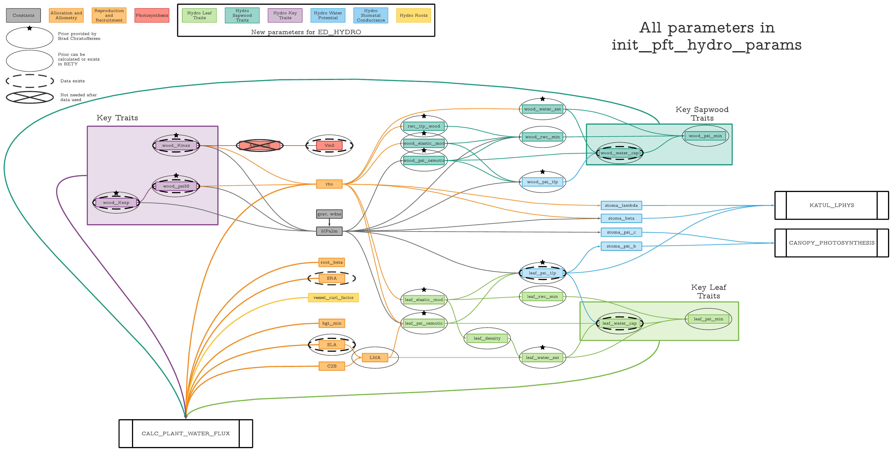

# Setup

```{r setup}
suppressPackageStartupMessages(library(ED.Hydro.Helpers))
suppressPackageStartupMessages(library(rlang))
suppressPackageStartupMessages(library(knitr))
options(digits = 10)



bety <- betyConnect("/fs/data3/ecowdery/pecan/web/config.php")
PFT3_defaults_history <- "/fs/data3/ecowdery/ED.Hydro/parameters/pft3_defaults_history.xml"

stats <- c("theor.min",
           "low.025", 
           "low.25", 
           "mean",
           "upp.75",
           "upp.975",
           "theor.max")

priors <- prior_load_data(download = FALSE, subset = TRUE)

kable(priors)

load("/fs/data3/ecowdery/ED.Hydro/parameters/prior_calculations/prior_data/accepted_dists.Rdata")

```
