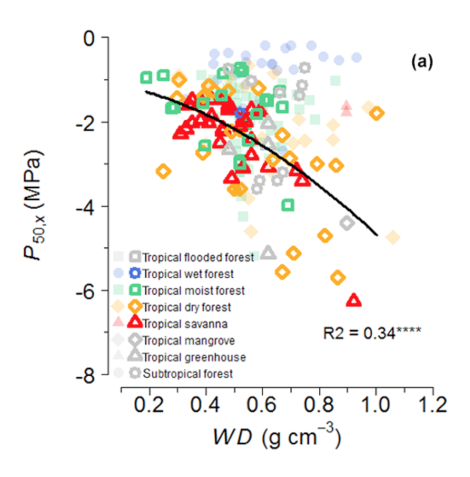

---
output:
  pdf_document: default
  html_document: default
---

```{r, out.width = "200px", echo = FALSE}

```

The equation as written in Table 2:

$$-(3.57 * WD)^{1.73} - 1.09$$

```{r, out.width = "200px"}
WD <- seq(.2, 1, length.out = 100)
p50 <- -(3.57 * WD ) ^ 1.73 - 1.09
plot(WD, p50)
```

Proposed edit:

$$-(3.57 * WD^{1.73}) - 1.09$$

```{r, out.width = "200px"}

WD <- seq(.2, 1, length.out = 100)
p50 <- -(3.57 * WD ^ 1.73)  - 1.09
plot(WD, p50)

```